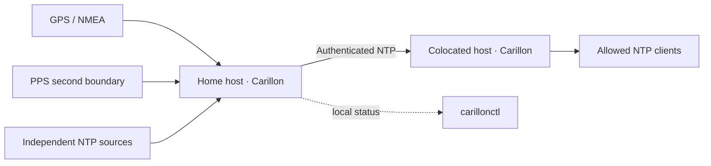

# Carillon

[](https://github.com/ptudor/carillon-time/actions/workflows/ci.yml)
[](https://github.com/ptudor/carillon-time/releases/latest)
[](.go-version)
[](LICENSE)

**A Go time daemon for Linux and FreeBSD, built around GPS, serial PPS, and an
operator who wants to understand what the clock is doing.**

Carillon can synchronize a host from NTP upstreams, discipline its clock from a
local reference, and serve time to explicitly allowed clients. A separate status
command shows the selected sources, clock correction, reference-clock health,
and server counters. Production builds are pure Go: two executables, no C runtime
dependency, no database.

[Install](#install) · [Try it safely](#try-it-safely) · [Configure](#configure-your-topology) · [Operations](docs/linux-packages.md) · [Design](DESIGN.md)

## A clock you can inspect

- **Network and local references.** NTP upstreams, NMEA GPS input, serial-port PPS,
  and Linux `/dev/ppsN` devices. A PPS pulse identifies a second boundary; NMEA or
  a qualified NTP source supplies the second number.
- **Explicit clock discipline.** Filtering, source selection, clustering, and a
  deterministic discipline loop. Frequency corrections persist in a drift file;
  step policy is configurable and clock steps are logged.
- **Controlled time service.** Serving is disabled until you configure allowed
  networks. Rate limits, bounded client tracking, and source-address filtering
  constrain the public server. Modes 6 and 7 are not answered; replies are no
  larger than their requests.
- **Authenticated associations.** AES-128-CMAC shared keys for a trusted upstream
  or selected clients. Keys live separately from configuration.
- **Useful observability.** A Unix control socket, read-only JSON status, health
  checks, Prometheus metrics, and optional daily statistics. HTTP monitoring is
  disabled until configured.



Start with an ordinary NTP client. Add a local reference or downstream clients
when the hardware and topology call for them.

## Current status

**An early release for technically involved operators.** Network client/server
operation, authenticated associations, Linux and FreeBSD clock backends, drift
persistence, and init integration have recorded acceptance runs on the maintainer’s
hosts. Live GPS/PPS stratum-1 acceptance and a sustained accuracy comparison are
still pending. Microsecond accuracy is a hardware-dependent target, not a published
measurement or guarantee.

Four review items remain open: GPS ZDA time-validity policy, expired leapfile
authority, source independence/quorum, and negative root-delay interoperability.
Read [known limitations](docs/limitations.md) before choosing a deployment.

| Platform | Release builds | Runtime scope |
| --- | --- | --- |
| Linux | amd64, arm64 | NTP client/server; Linux PPS and serial backends |
| FreeBSD | amd64, arm64 | NTP client/server; FreeBSD serial PPS backends |
| macOS | Build from source | Development tests, configuration checks, and `query`; clock discipline is unsupported |

Cross-compilation establishes build compatibility. It does not establish hardware
or native runtime acceptance on every architecture. NTS, PTP, hardware NIC
timestamping, and OpenWrt deployment are outside the current release scope.

## Install

Download binaries and packages from the
[1.0.0 release](https://github.com/ptudor/carillon-time/releases/tag/v1.0.0).
Choose the file matching your OS and architecture, then follow the
[verification instructions](docs/releases.md#verify-a-download).
Development snapshots are also available from successful
[CI runs](https://github.com/ptudor/carillon-time/actions/workflows/ci.yml).

| Asset | Contents |
| --- | --- |
| `carillon-time_<version>_<os>_<arch>.tar.gz` | `carillon`, `carillonctl`, configuration examples, deployment notes |
| `carillon_<version>_amd64.deb` / `…_arm64.deb` | Linux binaries, systemd unit, preserved configuration |
| `carillon-<version>-1.x86_64.rpm` / `…aarch64.rpm` | The same Linux installation for RPM systems |

From a directory containing the appropriate downloaded package:

```sh
# Debian / Ubuntu
sudo apt install ./carillon_*_amd64.deb

# Fedora / RHEL family (local packages are unsigned)
sudo dnf --setopt=localpkg_gpgcheck=0 install ./carillon-*.x86_64.rpm
```

Packages **do not start or enable the daemon** and do not stop your current time
service. Configuration starts as an NTP client, with downstream serving and device
access disabled. Follow [Linux setup](docs/linux-packages.md) to configure and activate
it. Packages are unsigned; release checksums and GitHub build attestations are
provided. There is no hosted APT/YUM repository.

For a manual installation or FreeBSD rc.d setup, use the
[deployment guide](deploy/README.md). Packaged binaries live in `/usr/bin`; manual
installation examples use `/usr/local`.

## Try it safely

You can inspect an NTP server without adjusting your machine’s clock:

```sh
carillon -version
carillon query -timeout 5s pool.ntp.org
```

`query` sends an NTP request and reports the response. It does not run the discipline
loop. To build and check configuration from a clone:

```sh
make build
./bin/carillon -version
make check-examples
./bin/carillon query -timeout 5s pool.ntp.org
```

Use the Go toolchain in [.go-version](.go-version). `make check-examples` also needs
Python 3; it checks both shipped configurations using temporary state/socket paths.
It does not change the clock or open reference-clock devices. The daemon’s `-check`
command verifies configuration, filesystem paths, and configured key/leap files;
network reachability and synchronization are separate operational checks.

## Configure your topology

The packaged configuration has three NTP Pool upstream entries and no `[serve]`
section. Choose appropriate independent upstreams for your network. Multiple
names alone do not establish independent clocks.

To serve a LAN, add an explicit allow list:

```toml
[serve]
listen = ["0.0.0.0:123", "[::]:123"]
allow = ["192.168.1.0/24"]
rate_limit_pps = 8
rate_burst = 16
```

Adapt the network to your deployment. For read-only monitoring on loopback:

```toml
[monitor]
listen = "127.0.0.1:8923"
```

See the [annotated configuration](deploy/carillon.toml.example) for PPS and GPS
devices, shared keys, public-server sizing, drift persistence, leapfiles, and
statistics. The [Linux package guide](docs/linux-packages.md#gps-and-pps-device-access)
shows the systemd drop-in needed to grant device access.

Once configured and running on the intended host:

```sh
sudo carillonctl tracking
sudo carillonctl sources
sudo carillonctl refclock
sudo carillonctl serverstats
sudo carillonctl waitsync 120
curl http://127.0.0.1:8923/api/v1/status
curl http://127.0.0.1:8923/healthz
curl http://127.0.0.1:8923/metrics
```

Only one daemon should discipline a host’s clock. Validate configuration first,
then stop the existing time service and explicitly enable Carillon as described in
the deployment guide. A service start can adjust time under the configured step
and discipline policy.

## Built to be examined

The discipline core takes measurements and elapsed time as inputs and returns
clock actions. Ordinary tests use fake clocks; platform bindings are separate.
The design document explains source qualification, holdover, timestamp handling,
clock epochs, and the choices behind the control loop.

```sh
make test            # Vet and race tests; fake clocks, no clock adjustment
make abicheck        # Native Linux/FreeBSD header-layout comparisons; needs C compiler
make linux           # Static Linux amd64 and arm64 binaries
make freebsd         # Static FreeBSD amd64 and arm64 binaries
make release-check   # Validate GoReleaser configuration
make snapshot        # Release archives, RPMs, and DEBs in dist/
```

GitHub CI runs native race tests on Linux amd64, Linux arm64, and macOS arm64;
Linux jobs also compare the kernel ABI against system headers. It cross-builds all
release targets and checks Linux packages in Debian and Fedora containers without
clock privileges. Hardware acceptance remains a separate operator task.

| Read next | Purpose |
| --- | --- |
| [Design](DESIGN.md) | Protocol and discipline specification |
| [Configuration](deploy/carillon.toml.example) | Annotated settings and topologies |
| [Linux packages](docs/linux-packages.md) / [Manual deployment](deploy/README.md) | Install, activate, inspect, upgrade |
| [Known limitations](docs/limitations.md) | Open review items and hardware acceptance gaps |
| [Release guide](docs/releases.md) | GitHub builds, packages, checksums, provenance |
| [Contributing](CONTRIBUTING.md) / [Security](SECURITY.md) | Development and private vulnerability reporting |

**License:** [MIT](LICENSE). Commercial use, modification, and redistribution
are permitted with the copyright and license notice preserved. Dependencies
retain their own licenses; see [third-party notices](THIRD_PARTY_NOTICES.md).

*A carillon is a set of tuned bells. This one keeps the time between the strikes.*
